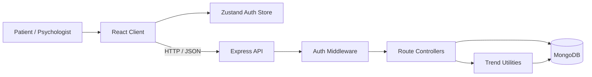
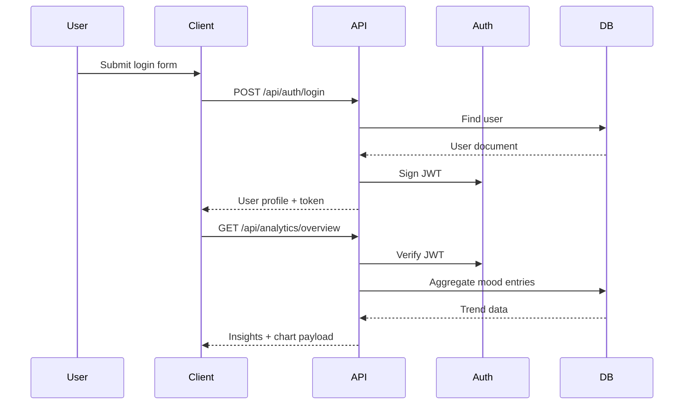

# Architecture

## Stack Justification

- MERN is a strong fit here because React handles a dynamic dashboard UI well, Express keeps the API simple and testable, and MongoDB suits flexible patient, entry, and note documents.
- Zustand keeps frontend auth and session state lightweight without Redux boilerplate.
- Mongoose models map naturally to user, mood entry, and personal note entities.
- JWT is appropriate for stateless session handling across patient and psychologist roles.

## System Flow

## Component Interaction Summary

1. The user signs in from the React client.
2. The backend validates credentials and returns a JWT.
3. Zustand stores the user session and attaches the token to Axios requests.
4. Protected Express routes validate the token and role.
5. Controllers read and write MongoDB documents using Mongoose.
6. Analytics utilities aggregate mood data for charts and insight cards.

## Request Lifecycle Example

