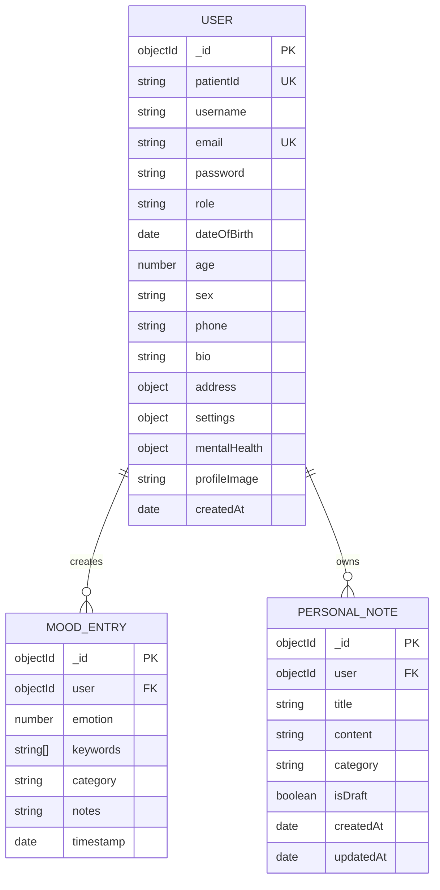

# Database Schema

## ER Diagram

## Table Structure Notes

### `User`

| Field | Type | Notes |
|---|---|---|
| `_id` | `ObjectId` | Primary key |
| `patientId` | `String` | Auto-generated unique patient reference |
| `username` | `String` | Required, unique |
| `email` | `String` | Required, unique |
| `password` | `String` | bcrypt hash |
| `role` | `String` | `patient`, `psychologist`, `admin` |
| `settings` | `Object` | Notification and appearance preferences |
| `mentalHealth` | `Object` | Diagnosis, medication, therapy, risk metadata |

### `MoodEntry`

| Field | Type | Notes |
|---|---|---|
| `_id` | `ObjectId` | Primary key |
| `user` | `ObjectId` | References `User._id` |
| `emotion` | `Number` | Range `1-10` |
| `keywords` | `String[]` | Optional tag list |
| `category` | `String` | General, Work, Social, Health, Family, Personal |
| `notes` | `String` | Optional context |
| `timestamp` | `Date` | Entry creation date |

### `PersonalNote`

| Field | Type | Notes |
|---|---|---|
| `_id` | `ObjectId` | Primary key |
| `user` | `ObjectId` | References `User._id` |
| `title` | `String` | Required |
| `content` | `String` | Required |
| `category` | `String` | User-selected note label |
| `isDraft` | `Boolean` | Draft support |
| `createdAt` | `Date` | Created time |
| `updatedAt` | `Date` | Updated time |
